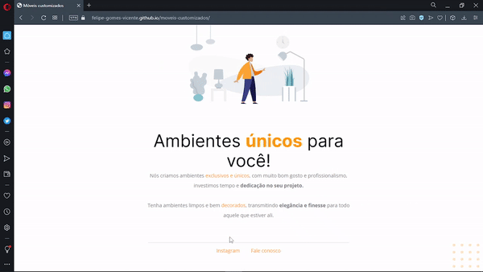
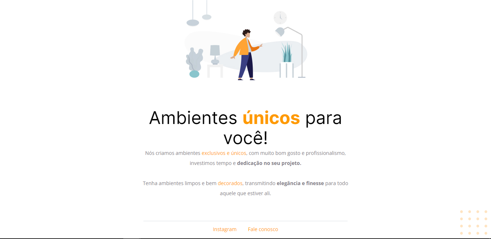

# Móveis Customizados

<h1 align="center">
    
</h1>

<br>

### 💻 Móveis Customizados

The challenge of this project is to fix bugs, web page that came disconfigured, 
use HTML and CSS knowledge from studying the Stage 2 module, use figma to follow 
the project prototype and fix the broken code. 
I went beyond the classes, challenging myself to refactor the project's file system 
structure, hover effect in the footer's link tag, decrease the margin proposed in 
the figma for the final page to respect the browser's height and not scroll unnecessarily.

Watch Webpage Online: [Click Here](https://felipe-gomes-vicente.github.io/moveis-customizados/)

What was developed:

- Structuring the project;
- Position of the elements on the screen;
- Import external CSS file into the project;
- Apply custom fonts (typography) to the CSS file and start the external CSS;
- Working with colors and fonts;
- Aligning and positioning text and elements;
- Applying spacing;
- Borders and element classifications;
- Use CSS variables to manipulate the project's color palette;
- Hover effect in the footer link HTML elements;
- CSS reset removing possible inconsistencies between different browsers;
- Project file system structure separated by folder;

I applied my knowledge of the Explorer from Rocketseat concepts in a practical way 
to this project, with the lessons:

- Introduction to HTML and CSS;

- [EXPLORER - Rocketseat](https://www.rocketseat.com.br/explorer)
- [Design Figma - Moveis Customizados](https://www.figma.com/file/S8vpYTmkKbcd9e64RFRqX6/Explorer---Projeto-01-(Copy)?node-id=0%3A1)

## Image from the final project:
 

<br />

## The page before the tweak had a few bugs, as shown below:
 

## 🧪 Tools

Application developed using the following tools:

- [HTML5](https://www.w3schools.com/html/default.asp)
- [CSS3](https://www.w3schools.com/css/default.asp)

## 🚀 Getting started

Live server with VScode or just clone folder and access index.html

### Programs needed to Getting started

- [Live Server (Opcional)](https://marketplace.visualstudio.com/items?itemName=ritwickdey.LiveServer)
- [Visual Studio Code - Vscode](https://code.visualstudio.com/)

Clone the project and access the folder.

```bash
$ git clone https://github.com/felipe-gomes-vicente/moveis-customizados.git
$ cd moveis-customizados
```

## 📝 License

This project is under the MIT license. See the file [LICENSE](LICENSE.md) for more details.

---

&nbsp;

<p align="center">Done with 💜 by Felipe Vicente👋</p>

- ## My LinkedIn - [](https://www.linkedin.com/in/felipe-gomes-vicente/)
